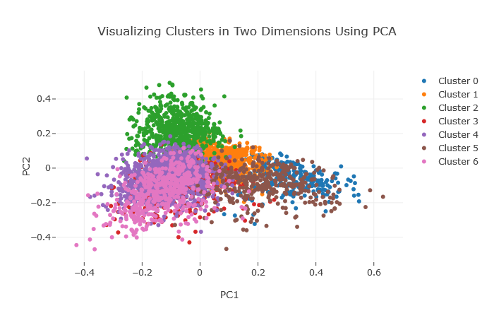
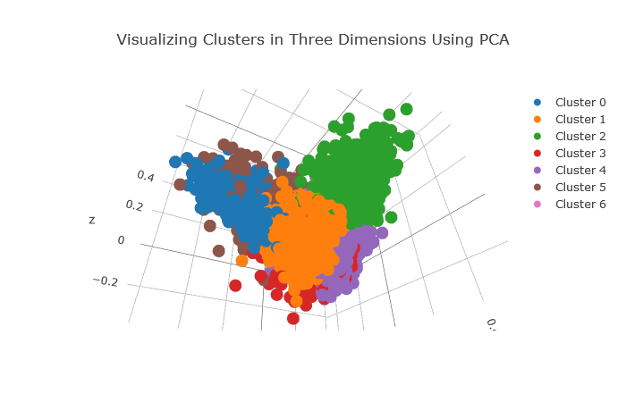
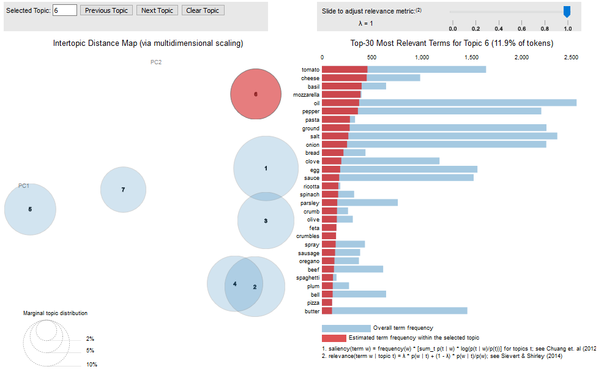
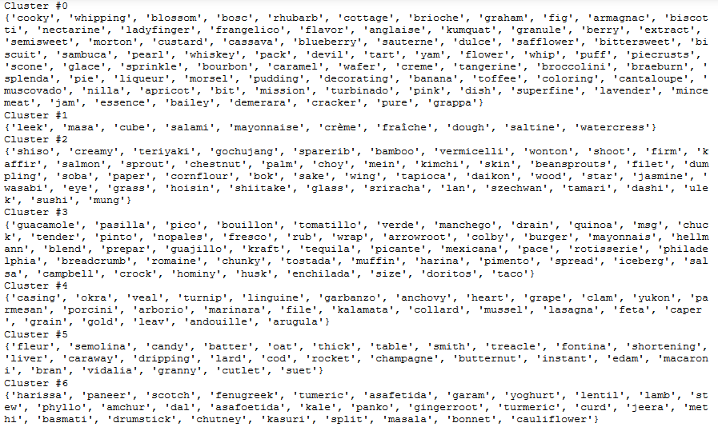
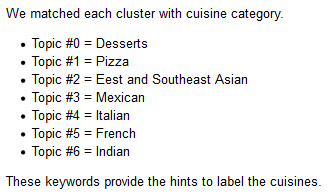

# Cuisine Clustering

## Problem Statement
## 1. The Goal

* Build a feature that enables users to query by cuisine, not just by ingredients. All of your recipes are unlabeled, and it's infeasible to label them by hand.
  
* Design and execute a method to group the recipes by cuisine to be robust enough to understand similarities / substitutions between ingredients. For each major cuisine, find the driving ingredients that characterize it.
  
* Provide a guideline for an outsourced team to hand label the remaining corpus.

## 2. Data Intake
* .json file

## 3. Apporch Used
1. Data preprocessing: conventional NLTK preprocess
2. Feature engineering: BoWs, TF-IDF, POS (part-of-speech)
3. Clustering: K-means, topic modeling (LDA)
4. Visualization: 2D & 3D PCA, pyLDAvis

2D-PCA results
  

  
  

3D-PCA results
  

  
  

LDA topic modeling results
  

  
  

Driving ingredients extracted
  

  
  

Cuisine clustering
  

  
  

